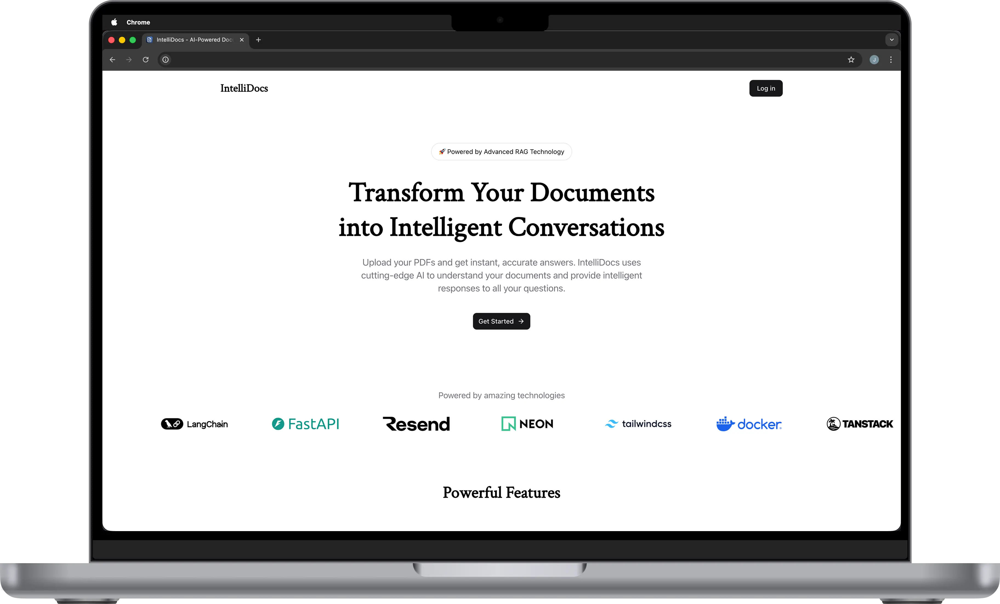
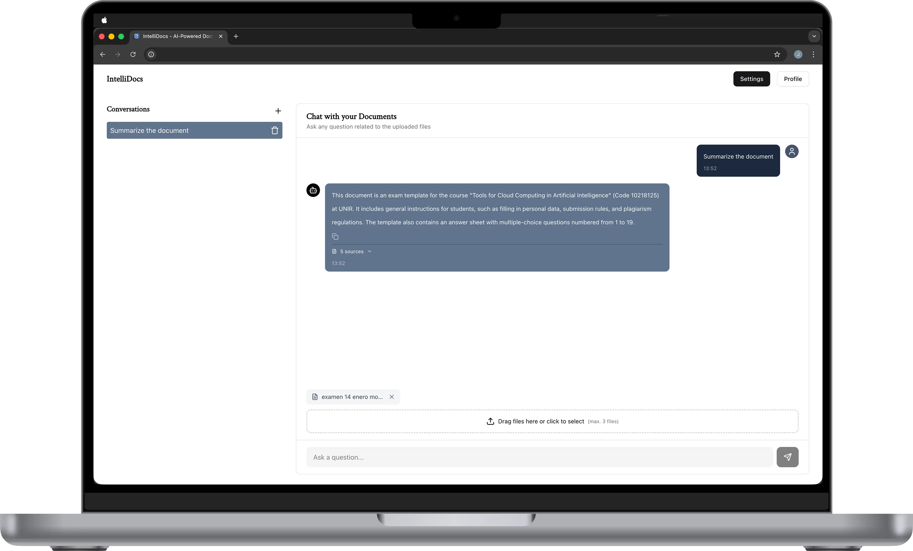

# IntelliDocs

---

Unlock insights from your PDFs with advanced AI-powered conversations. IntelliDocs uses cutting-edge Retrieval-Augmented Generation (RAG) technology to understand your documents and provide accurate, context-aware answers to all your questions.

---

## Technologies Used

### Frontend
- **Tanstack Start** - Full-stack React framework
- **Tailwind CSS v4** - Utility-first styling
- **Shadcn/ui** - Accessible UI components
- **Lucide React** - High-quality icons
- **Vite** - Fast development server and build tool
- **Zustand** - State management library

### Backend
- **FastAPI** - Fast and efficient web framework for building APIs
- **LangGraph** - Powerful framework for building LLM applications
- **Asyncpg** - Asynchronous PostgreSQL driver for Python
- **Websockets** - Real-time communication protocol for web applications
- **Pydantic** - Data validation and settings management using Python type annotations
- **PyPDF** - Python library for working with PDF files
- **OpenRouter** - Open-source API for accessing LLMs

### Auth
- **Better Auth** - Secure authentication and authorization
- **Resend** - Email delivery service

### Database & ORM
- **Drizzle ORM** - Type-safe modern ORM to interact with a PostgreSQL database
- **Neon** - Vector database for efficient similarity search

---

## Features

- **Upload documents**
- **Ask questions** in natural language about the content
- **Receive intelligent answers** powered by a RAG agent
- **Get references** to specific document sections
- **Secure authentication** with Better Auth with third-party providers
- **Email verification** with Resend

---

## The process

I started by making a simple chatbot in Tanstack Start, and created the RAG agent directly in the frontend using LangGraph, since it has native Typescript support, so I did not need to create a separate backend. Then, I integrated Better Auth and Drizzle ORM to store the conversation history and user information, allowing users to access their data across multiple devices.

The problem with this architecture is that if a user sent a message to the agent and the user closed the browser, the response would be lost. So in order to solve this problem, I created a proper backend using FastAPI and migrated the RAG agent from the frontend to the backend. This allowed me to store the conversation history and user information in a database, and to retrieve it when the user returns to the application.

Finally, I added websockets support to cover the edge case when the user closes the browser, reconnects, and the backend is still processing the request, so when the message is finally processed, the frontend gets notified and displays the response.

---

## How can it be improved?
- Streaming support
- Sync state across multiple tabs with websockets
- Support for multiple languages
- Responsive design

---

## Run the project

1. Clone the repository
2. Start docker
3. Run with docker-compose up
4. Open your browser at `http://localhost:3000`

---

## Environment Variables

- **DATABASE_URL** - PostgreSQL database URL
- **ENVIRONMENT** - Environment (DEV or PROD)
- **VITE_ENVIRONMENT** - Vite environment (DEV or PROD)
- **BASE_URL_DEV** - Base URL for development environment
- **RESEND_API_KEY** - Resend API key
- **GOOGLE_CLIENT_ID** - Google client ID
- **GOOGLE_CLIENT_SECRET** - Google client secret
- **VITE_BACKEND_URL_DEV** - Backend URL for development environment
- **VITE_BACKEND_URL_DEV_INTERNAL** - Backend URL for development environment when using Docker
- **VITE_BACKEND_URL_PROD** - Backend URL for production environment

---

## Preview

    
    

